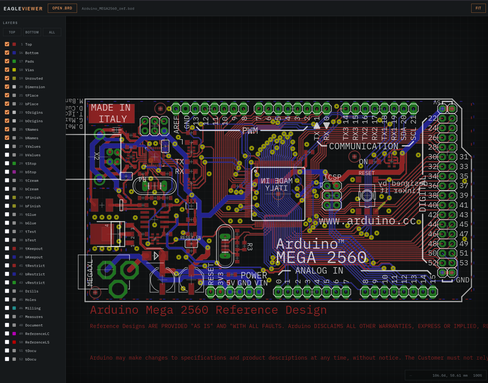

# EagleViewer

A web-based viewer for Autodesk EAGLE board files (`.brd`), written in dependency-free
vanilla JavaScript — no framework, no build step. Open a board straight in the browser.



## Features

- **EAGLE 6.x XML `.brd` rendering** to SVG: traces (including arcs), copper pours,
  vias and pads (round, square, octagon, long and offset shapes with real geometry),
  SMDs, silkscreen, texts and component packages
- **Net inspection** — hover any trace, via or pour to highlight the whole net in
  copper and read the signal name in the HUD
- **Layer panel** with per-layer color chips, individual toggles and
  Top / Bottom / All presets
- **Component labels** — `>NAME` / `>VALUE` substitution per element, including
  smashed elements with repositioned labels, and proper side-swapping for mirrored
  (bottom) components
- **Readable copper** — a subtle separation outline follows the outer contour of
  connected copper at constant on-screen thickness, and the silkscreen paints
  translucent white above everything
- **Instrument-style dark UI** with a millimeter grid, oscilloscope-like HUD
  (hovered signal, cursor position in mm, zoom level)
- **Smooth navigation** — cursor-anchored wheel/trackpad zoom, mouse/touch/pen
  panning via PointerEvents, fit-to-view based on the board outline
- **Drag and drop** a `.brd` file anywhere in the window to open it

## Quick start

Serve the `src/` directory over HTTP and open it in a modern browser:

```bash
python3 -m http.server 8000 -d src
# then open http://localhost:8000
```

The bundled Arduino MEGA 2560 reference design loads automatically; use
**Open .brd** or drag-and-drop to view your own boards. Opening `index.html`
directly from `file://` does not work — ES modules and the sample-board fetch
require HTTP.

## Controls

| Action | Input |
|---|---|
| Pan | Left-drag (mouse, touch or pen) |
| Zoom | Mouse wheel / trackpad scroll, anchored at the cursor |
| Fit board to view | **Fit** button |
| Inspect a net | Hover any trace, via or pour |
| Show/hide layers | Checkboxes or Top / Bottom / All presets |

## Development

The app is plain ES modules under `src/js/` (`render.js`, `viewport.js`, `ui.js`,
`main.js`) plus `index.html`/`index.css` — edit and reload, no tooling required.
The optional Grunt setup copies `src/` to `dist/` and deploys to GitHub Pages:

```bash
npm install
npx grunt            # build into dist/
npx grunt watch      # rebuild on change
npx grunt publish    # deploy dist/ to GitHub Pages
```

Requires a modern browser (native ES modules and PointerEvents). See
[CHANGELOG.md](CHANGELOG.md) for release history.

## Credits

- Original demo by Andreas Herz ([FreeGroup](https://github.com/freegroup/eagle_viewer))
- Modernized and maintained by **Pir0c0pter0** — <pir0c0pter0000@gmail.com>

## License

GPL
